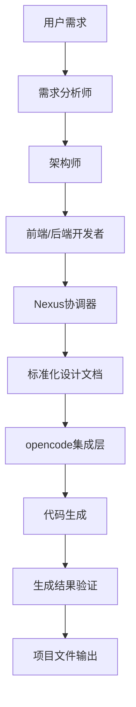

# opencode集成方案详细设计

## 1. 概述

本文档详细描述了将opencode集成到agency-agents项目中的方案。通过集成opencode，我们将实现AI驱动的设计与专业代码生成工具的结合，使系统能够处理任意类型的项目需求。

## 2. 架构设计

### 2.1 整体架构图

```
┌─────────────────┐    ┌──────────────────┐    ┌─────────────────┐
│   用户需求      │ -> │  AI代理系统      │ -> │  详细设计文档   │
│                 │    │                  │    │                 │
│ (任意项目类型)   │    │ - 需求分析师    │    │ (标准化格式)    │
│                 │    │ - 架构师        │    │                 │
│                 │    │ - 前端开发者    │    │                 │
│                 │    │ - 后端开发者    │    │                 │
└─────────────────┘    └──────────────────┘    └─────────────────┘
                                                                 │
                                                                 ▼
                                            ┌─────────────────────────────────┐
                                            │     opencode集成层              │
                                            │                                 │
                                            │ - 设计文档格式转换              │
                                            │ - opencode API调用              │
                                            │ - 文件生成结果处理              │
                                            └─────────────────────────────────┘
                                                                 │
                                                                 ▼
                                            ┌─────────────────────────────────┐
                                            │        生成的项目文件           │
                                            │                               │
                                            │ - 源代码文件                   │
                                            │ - 配置文件                    │
                                            │ - 依赖管理文件                 │
                                            │ - 文档文件                    │
                                            └─────────────────────────────────┘
```

### 2.2 集成层次

1. **设计层**：AI代理负责需求分析、架构设计和详细设计
2. **转换层**：将设计文档转换为opencode可理解的格式
3. **执行层**：opencode负责实际的代码生成和文件创建
4. **反馈层**：收集生成结果并反馈给用户

## 3. 详细设计方案

### 3.1 设计文档标准化

#### 3.1.1 设计文档结构

设计文档需要包含以下关键信息：

```yaml
---
project_type: "web-application"  # 项目类型标识
project_name: "用户定义的项目名称"
description: "项目描述"
technologies:  # 使用的技术栈
  - "react"
  - "nodejs"
  - "postgresql"
files:  # 需要生成的文件列表
  - path: "src/index.js"
    purpose: "主入口文件"
    dependencies: []
    content_outline: "文件内容大纲"
directories:  # 需要创建的目录结构
  - path: "src/components"
    purpose: "React组件目录"
dependencies:  # 项目依赖
  runtime: []  # 运行时依赖
  dev: []      # 开发依赖
configuration_files:  # 配置文件
  - path: "package.json"
    type: "npm-manifest"
    content: {}
deployment:  # 部署配置
  target: "docker"
  environment: "production"
---
```

#### 3.1.2 设计文档生成流程

1. 需求分析师代理分析用户需求
2. 架构师代理制定架构方案
3. 前端/后端开发者代理制定详细实现方案
4. Nexus协调器整合各代理输出，生成标准化设计文档

### 3.2 opencode集成实现

#### 3.2.1 opencode安装与配置

```bash
# 安装opencode CLI工具
npm install -g opencode

# 或者使用脚本安装
./scripts/install.sh --tool opencode
```

#### 3.2.2 opencode API调用接口

```javascript
// opencode集成模块
class OpenCodeIntegration {
  constructor(config) {
    this.config = config;
    this.apiKey = config.apiKey;
    this.endpoint = config.endpoint || 'http://localhost:3002'; // 默认端点
  }

  /**
   * 提交设计文档给opencode进行代码生成
   * @param {Object} designDoc - 标准化设计文档
   * @param {string} targetDir - 目标生成目录
   */
  async generateFromDesign(designDoc, targetDir) {
    const payload = {
      design: designDoc,
      target_directory: targetDir,
      project_config: {
        initialize_git: true,
        create_readme: true,
        setup_dependencies: true
      }
    };

    try {
      const response = await fetch(`${this.endpoint}/api/generate`, {
        method: 'POST',
        headers: {
          'Content-Type': 'application/json',
          'Authorization': `Bearer ${this.apiKey}`
        },
        body: JSON.stringify(payload)
      });

      if (!response.ok) {
        throw new Error(`opencode API调用失败: ${response.statusText}`);
      }

      return await response.json();
    } catch (error) {
      console.error('opencode调用错误:', error);
      throw error;
    }
  }

  /**
   * 检查opencode服务状态
   */
  async checkStatus() {
    try {
      const response = await fetch(`${this.endpoint}/health`);
      return response.ok;
    } catch (error) {
      return false;
    }
  }
}
```

#### 3.2.3 设计文档格式转换

```javascript
class DesignDocConverter {
  /**
   * 将标准化设计文档转换为opencode格式
   * @param {Object} designDoc - 输入的设计文档
   * @returns {Object} 转换后的opencode兼容格式
   */
  static convertToOpenCodeFormat(designDoc) {
    const opencodeFormat = {
      project: {
        name: designDoc.project_name,
        description: designDoc.description,
        type: designDoc.project_type
      },
      structure: {
        files: designDoc.files.map(file => ({
          path: file.path,
          description: file.purpose,
          outline: file.content_outline
        })),
        directories: designDoc.directories.map(dir => ({
          path: dir.path,
          description: dir.purpose
        }))
      },
      technologies: designDoc.technologies,
      dependencies: {
        runtime: designDoc.dependencies.runtime,
        dev: designDoc.dependencies.dev
      },
      configurations: designDoc.configuration_files,
      deployment: designDoc.deployment
    };

    return opencodeFormat;
  }
}
```

### 3.3 工作流集成

#### 3.3.1 requirements-to-design工作流增强

在原有的requirements-to-design工作流基础上，增加设计文档标准化步骤：



#### 3.3.2 新增design-to-code工作流

```javascript
// 新的工作流：design-to-opencode
class DesignToOpencodeWorkflow {
  constructor() {
    this.opencodeIntegration = new OpenCodeIntegration(this.loadConfig());
  }

  async execute(taskId, designDocPath, targetDir) {
    // 1. 读取设计文档
    const designDoc = await this.readDesignDocument(designDocPath);

    // 2. 验证设计文档完整性
    if (!this.validateDesignDoc(designDoc)) {
      throw new Error('设计文档格式不正确或缺少必要信息');
    }

    // 3. 转换为opencode格式
    const opencodeFormat = DesignDocConverter.convertToOpenCodeFormat(designDoc);

    // 4. 提交给opencode生成代码
    const result = await this.opencodeIntegration.generateFromDesign(
      opencodeFormat, 
      targetDir
    );

    // 5. 验证生成结果
    await this.verifyGeneratedFiles(result, targetDir);

    // 6. 返回生成结果
    return {
      success: true,
      generated_files: result.generated_files,
      target_directory: targetDir,
      execution_time: result.execution_time
    };
  }

  async verifyGeneratedFiles(generationResult, targetDir) {
    // 验证生成的文件是否符合预期
    const expectedFiles = generationResult.expected_files || [];
    const actualFiles = await this.listFiles(targetDir);
    
    const missingFiles = expectedFiles.filter(expected => 
      !actualFiles.includes(expected)
    );
    
    if (missingFiles.length > 0) {
      console.warn('警告：以下文件未生成:', missingFiles);
    }
  }
}
```

### 3.4 GUI集成

#### 3.4.1 设置页面集成

在web-gui的SettingsPage中添加opencode配置：

```jsx
// web-gui/src/pages/SettingsPage.jsx 的扩展
const OpencodeConfigSection = () => {
  const [config, setConfig] = useState({
    apiKey: '',
    endpoint: 'http://localhost:3002',
    enabled: false
  });
  const [status, setStatus] = useState('unknown'); // unknown, loading, success, error

  const handleSave = async () => {
    try {
      // 保存配置到后端
      await api.saveOpencodeConfig(config);
      
      // 测试连接
      const isConnected = await api.testOpencodeConnection();
      setStatus(isConnected ? 'success' : 'error');
    } catch (error) {
      setStatus('error');
      console.error('保存opencode配置失败:', error);
    }
  };

  const handleInstall = async () => {
    try {
      await api.installOpencode();
      alert('opencode安装成功！');
    } catch (error) {
      alert('opencode安装失败：' + error.message);
    }
  };

  return (
    <div className="opencode-config-section">
      <h3>opencode 集成配置</h3>
      
      <div className="config-row">
        <label>API密钥:</label>
        <input
          type="password"
          value={config.apiKey}
          onChange={(e) => setConfig({...config, apiKey: e.target.value})}
        />
      </div>
      
      <div className="config-row">
        <label>服务端点:</label>
        <input
          type="text"
          value={config.endpoint}
          onChange={(e) => setConfig({...config, endpoint: e.target.value})}
        />
      </div>
      
      <div className="config-row">
        <label>
          <input
            type="checkbox"
            checked={config.enabled}
            onChange={(e) => setConfig({...config, enabled: e.target.checked})}
          />
          启用opencode集成
        </label>
      </div>
      
      <div className="button-group">
        <button onClick={handleInstall}>一键安装opencode</button>
        <button onClick={handleSave}>保存配置</button>
        <span className={`status-indicator ${status}`}>
          {status === 'success' && '✓ 连接正常'}
          {status === 'error' && '✗ 连接失败'}
          {status === 'loading' && '测试中...'}
          {status === 'unknown' && '未测试'}
        </span>
      </div>
    </div>
  );
};
```

#### 3.4.2 任务页面集成

在TaskPage中显示opencode生成进度：

```jsx
// opencode生成状态组件
const OpencodeGenerationStatus = ({ taskId }) => {
  const [progress, setProgress] = useState(null);
  const [logs, setLogs] = useState([]);

  useEffect(() => {
    // 监听opencode生成进度
    const eventSource = new EventSource(`/api/tasks/${taskId}/opencode-status`);
    
    eventSource.onmessage = (event) => {
      const data = JSON.parse(event.data);
      setProgress(data.progress);
      setLogs(prev => [...prev, data.log]);
    };
    
    return () => eventSource.close();
  }, [taskId]);

  return (
    <div className="opencode-generation-status">
      <h4>代码生成进度</h4>
      {progress && (
        <div className="progress-container">
          <div 
            className="progress-bar" 
            style={{ width: `${progress.percentage}%` }}
          >
            {progress.currentStep} ({progress.percentage}%)
          </div>
        </div>
      )}
      
      <div className="generation-logs">
        <h5>生成日志:</h5>
        <pre>{logs.join('\n')}</pre>
      </div>
    </div>
  );
};
```

### 3.5 API接口设计

#### 3.5.1 opencode配置API

```javascript
// server.js 中新增的API端点

// 获取opencode配置状态
app.get('/api/opencode/status', async (req, res) => {
  try {
    const opencodeIntegration = new OpenCodeIntegration(getConfig());
    const status = await opencodeIntegration.checkStatus();
    
    res.json({
      connected: status,
      configured: !!getConfig().apiKey,
      endpoint: getConfig().endpoint
    });
  } catch (error) {
    res.status(500).json({ error: error.message });
  }
});

// 保存opencode配置
app.post('/api/opencode/config', async (req, res) => {
  try {
    const { apiKey, endpoint, enabled } = req.body;
    
    // 验证配置
    if (enabled && !apiKey) {
      return res.status(400).json({ error: '启用opencode需要提供API密钥' });
    }
    
    // 保存配置
    await saveConfig({ opencode: { apiKey, endpoint, enabled } });
    
    res.json({ success: true });
  } catch (error) {
    res.status(500).json({ error: error.message });
  }
});

// 测试opencode连接
app.post('/api/opencode/test-connection', async (req, res) => {
  try {
    const opencodeIntegration = new OpenCodeIntegration(getConfig());
    const connected = await opencodeIntegration.checkStatus();
    
    res.json({ connected });
  } catch (error) {
    res.status(500).json({ connected: false, error: error.message });
  }
});

// 安装opencode
app.post('/api/opencode/install', async (req, res) => {
  try {
    // 执行安装脚本
    const result = await exec('npm install -g opencode');
    
    res.json({ 
      success: true, 
      output: result.stdout,
      error: result.stderr 
    });
  } catch (error) {
    res.status(500).json({ 
      success: false, 
      error: error.message 
    });
  }
});

// 提交设计文档给opencode生成
app.post('/api/opencode/generate', async (req, res) => {
  try {
    const { designDoc, targetDir } = req.body;
    
    const opencodeIntegration = new OpenCodeIntegration(getConfig());
    const result = await opencodeIntegration.generateFromDesign(designDoc, targetDir);
    
    res.json(result);
  } catch (error) {
    res.status(500).json({ error: error.message });
  }
});
```

### 3.6 错误处理与重试机制

#### 3.6.1 错误分类与处理

1. **连接错误**：opencode服务不可达
   - 自动重试机制
   - 用户友好的错误提示

2. **认证错误**：API密钥无效
   - 引导用户重新配置
   - 安全的密钥存储

3. **生成错误**：代码生成失败
   - 详细的错误日志
   - 生成部分结果的保存

#### 3.6.2 重试机制实现

```javascript
class RetryableOpenCodeIntegration extends OpenCodeIntegration {
  async generateFromDesignWithRetry(designDoc, targetDir, maxRetries = 3) {
    let lastError;
    
    for (let attempt = 0; attempt <= maxRetries; attempt++) {
      try {
        if (attempt > 0) {
          // 指数退避延迟
          await this.delay(Math.pow(2, attempt) * 1000);
        }
        
        return await this.generateFromDesign(designDoc, targetDir);
      } catch (error) {
        lastError = error;
        
        if (attempt === maxRetries) {
          console.error(`opencode生成失败，已重试${maxRetries}次:`, error);
          throw error;
        }
        
        console.warn(`opencode生成尝试${attempt + 1}失败，准备重试...`);
      }
    }
    
    throw lastError;
  }
  
  delay(ms) {
    return new Promise(resolve => setTimeout(resolve, ms));
  }
}
```

## 4. 实施计划

### 4.1 第一阶段：基础集成（1-2周）
- [ ] 完善opencode集成模块
- [ ] 实现设计文档格式转换
- [ ] 添加基本的API接口
- [ ] 测试基本功能

### 4.2 第二阶段：GUI集成（1周）
- [ ] 在设置页面添加opencode配置
- [ ] 实现安装向导
- [ ] 添加连接测试功能
- [ ] 用户界面优化

### 4.3 第三阶段：工作流集成（1-2周）
- [ ] 集成到现有工作流
- [ ] 实现进度监控
- [ ] 添加错误处理
- [ ] 完整的功能测试

### 4.4 第四阶段：优化完善（1周）
- [ ] 性能优化
- [ ] 用户体验改进
- [ ] 文档完善
- [ ] 发布准备

## 5. 部署与维护

### 5.1 部署要求
- Node.js >= 14.0.0
- opencode CLI工具
- Redis（用于任务队列）
- 足够的磁盘空间用于项目生成

### 5.2 监控指标
- opencode连接状态
- 生成成功率
- 平均生成时间
- 错误率统计

### 5.3 维护指南
- 定期检查opencode服务状态
- 监控生成任务队列
- 更新依赖和安全补丁
- 备份配置和重要数据

## 6. 风险评估与应对

### 6.1 技术风险
- **风险**：opencode API变更导致集成失效
- **应对**：封装API调用，便于快速适配

- **风险**：生成的代码质量不符合预期
- **应对**：添加代码质量检查步骤

### 6.2 运维风险
- **风险**：opencode服务不稳定
- **应对**：实现降级方案，支持本地生成模式

- **风险**：大量并发生成任务导致资源耗尽
- **应对**：实现任务队列和资源限制

## 7. 模型集成架构优化

### 7.1 当前模型架构分析

根据现有代码（services/coding-plan.js），我们发现当前系统已经支持多种AI服务商：

- **阿里云**：支持通义千问系列模型
- **腾讯云**：支持混元系列模型  
- **百度云**：支持文心一言系列模型
- **自定义平台**：支持OpenAI兼容接口

### 7.2 模型路由重构方案

为了支持不同AI代理使用不同模型ID，同时共享API密钥，我们需要重构模型集成架构：

#### 7.2.1 配置结构更新

```javascript
// config/coding-plan.json 配置示例
{
  "default_api_key": "your-shared-api-key",
  "model_routes": {
    "design": {
      "model_id": "qwen-max",           // 用于设计任务的模型
      "provider": "aliyun-qianwen",
      "temperature": 0.1
    },
    "code_generation": {
      "model_id": "qwen-plus",         // 用于代码生成的模型
      "provider": "aliyun-qianwen", 
      "temperature": 0.3
    },
    "opencode": {
      "model_id": "opencode-specific-model", // 用于opencode集成的模型
      "provider": "opencode-provider",
      "temperature": 0.5
    }
  }
}
```

#### 7.2.2 模型路由服务实现

```javascript
/**
 * 模型路由服务 - 支持多模型ID，共享API密钥
 */
class ModelRouterService {
  constructor(config) {
    this.config = config;
    this.codingPlanService = new CodingPlanService(config.providers);
  }

  /**
   * 根据任务类型路由到相应模型
   */
  async routeRequest(requestType, prompt, options = {}) {
    const modelConfig = this.config.model_routes[requestType];
    
    if (!modelConfig) {
      throw new Error(`No model configuration for type: ${requestType}`);
    }

    // 为不同任务类型选择合适的模型
    switch (requestType) {
      case 'design':
        return await this.codingPlanService.callAliyun(prompt, modelConfig.model_id);
      case 'code_generation':
        return await this.codingPlanService.callAliyun(prompt, modelConfig.model_id);
      case 'opencode':
        // 可以调用opencode CLI或API
        return await this.executeOpenCodeCommand(prompt, options);
      default:
        throw new Error(`Unknown request type: ${requestType}`);
    }
  }

  /**
   * 执行opencode CLI命令
   */
  async executeOpenCodeCommand(prompt, options = {}) {
    const { spawn } = require('child_process');
    const fs = require('fs');
    const path = require('path');
    
    return new Promise((resolve, reject) => {
      const targetDir = options.targetDir || './generated-project';
      
      // 确保目标目录存在
      if (!fs.existsSync(targetDir)) {
        fs.mkdirSync(targetDir, { recursive: true });
      }
      
      // 执行opencode命令
      const child = spawn('opencode', [
        prompt,
        '--output-dir',
        targetDir,
        ...(options.additionalArgs || [])
      ], {
        cwd: process.cwd(),
        stdio: ['pipe', 'pipe', 'pipe']
      });

      let output = '';
      let errorOutput = '';

      child.stdout.on('data', (data) => {
        output += data.toString();
      });

      child.stderr.on('data', (data) => {
        errorOutput += data.toString();
      });

      child.on('close', (code) => {
        if (code === 0) {
          resolve({
            success: true,
            output: output,
            targetDir: targetDir
          });
        } else {
          reject(new Error(`opencode command failed with code ${code}: ${errorOutput}`));
        }
      });

      // 如果有输入数据，写入子进程
      if (options.input) {
        child.stdin.write(options.input);
        child.stdin.end();
      }
    });
  }
}
```

#### 7.2.3 AI代理集成

在各个AI代理中使用模型路由服务：

```javascript
// 架构师代理 - 使用设计模型
class ArchitectAgent {
  constructor(modelRouter) {
    this.modelRouter = modelRouter;
  }

  async generateDesign(requirements) {
    return await this.modelRouter.routeRequest(
      'design', 
      `Based on these requirements: ${requirements}, create a detailed technical design.`,
      { max_tokens: 2000 }
    );
  }
}

// 代码生成代理 - 使用代码生成模型
class CodeGeneratorAgent {
  constructor(modelRouter) {
    this.modelRouter = modelRouter;
  }

  async generateCode(designDoc) {
    return await this.modelRouter.routeRequest(
      'code_generation',
      `Generate code based on this design document: ${JSON.stringify(designDoc)}`,
      { max_tokens: 4096 }
    );
  }
}

// opencode集成代理 - 使用opencode专用流程
class OpenCodeAgent {
  constructor(modelRouter) {
    this.modelRouter = modelRouter;
  }

  async executeOpenCodeGeneration(designDoc, targetDir) {
    const prompt = this.formatDesignForOpenCode(designDoc);
    return await this.modelRouter.routeRequest(
      'opencode',
      prompt,
      { targetDir: targetDir }
    );
  }

  formatDesignForOpenCode(designDoc) {
    // 将设计文档转换为适合opencode的格式
    return `
Create a project based on the following design specification:

Project Name: ${designDoc.project_name}
Description: ${designDoc.description}
Technologies: ${designDoc.technologies.join(', ')}
Files to create:
${designDoc.files.map(f => `- ${f.path}: ${f.purpose}`).join('\n')}

Please create all necessary files and ensure the project is functional.
    `;
  }
}
```

### 7.3 阿里云Coding Plan集成

阿里云的Coding Plan支持多种模型，我们可以利用这一优势：

#### 7.3.1 阿里云配置优化

```javascript
// 针对阿里云的配置优化
const aliCloudConfig = {
  endpoint: 'https://dashscope.aliyuncs.com/api/v1',  // 标准DashScope端点
  codingPlanEndpoint: 'https://coding.dashscope.aliyuncs.com',  // Coding Plan专用端点
  models: {
    design: 'qwen-max',              // 复杂设计任务
    code_generation: 'qwen-plus',    // 代码生成任务
    general: 'qwen-turbo'            // 一般性任务
  }
};
```

#### 7.3.2 阿里云专用服务类

```javascript
/**
 * 阿里云专用服务 - 支持多种模型和Coding Plan
 */
class AliCloudService {
  constructor(config) {
    this.config = config;
  }

  /**
   * 调用指定模型
   */
  async callModel(modelType, prompt, options = {}) {
    const modelId = this.config.models[modelType] || 'qwen-plus';
    const endpoint = this.config.codingPlanEndpoint || this.config.endpoint;
    
    // 根据端点类型选择API格式
    const isCodingPlan = endpoint.includes('coding.dashscope.aliyuncs.com');
    
    const requestData = isCodingPlan 
      ? this.buildOpenAICompatibleRequest(modelId, prompt, options)
      : this.buildDashScopeRequest(modelId, prompt, options);
    
    const response = await axios.post(
      `${endpoint}/chat/completions`,
      requestData,
      {
        headers: {
          'Authorization': `Bearer ${this.config.apiKey}`,
          'Content-Type': 'application/json'
        },
        timeout: 60000
      }
    );
    
    return this.extractResponse(response.data, isCodingPlan);
  }

  buildOpenAICompatibleRequest(modelId, prompt, options) {
    return {
      model: modelId,
      messages: [
        { role: 'system', content: 'You are an expert AI assistant for software development.' },
        { role: 'user', content: prompt }
      ],
      temperature: options.temperature || 0.7,
      max_tokens: options.max_tokens || 4096
    };
  }

  buildDashScopeRequest(modelId, prompt, options) {
    return {
      model: modelId,
      input: {
        messages: [
          { role: 'system', content: 'You are an expert AI assistant for software development.' },
          { role: 'user', content: prompt }
        ]
      },
      parameters: {
        temperature: options.temperature || 0.7,
        max_tokens: options.max_tokens || 4096
      }
    };
  }

  extractResponse(data, isCodingPlan) {
    if (isCodingPlan) {
      return data.choices[0]?.message?.content || data.choices[0]?.text;
    } else {
      return data.output?.choices[0]?.message?.content || data.output?.text;
    }
  }
}
```

### 7.4 完整集成架构

最终的集成架构如下：

```
┌─────────────────┐    ┌──────────────────┐    ┌─────────────────┐
│  AI代理系统     │ -> │  模型路由层     │ -> │  多模型支持     │
│                 │    │                  │    │                 │
│ - 需求分析师    │ -> │ - 设计模型路由   │ -> │ - qwen-max     │
│ - 架构师        │ -> │ - 代码模型路由   │ -> │ - qwen-plus    │
│ - 开发者        │ -> │ - opencode路由   │ -> │ - Coding Plan  │
│ - Nexus协调器   │ -> │ - 通用模型路由   │ -> │ - 其他模型     │
└─────────────────┘    └──────────────────┘    └─────────────────┘
                              │
                              ▼
                       ┌─────────────────┐
                       │  opencode CLI   │
                       │  代码生成       │
                       └─────────────────┘
```

## 8. 总结

通过集成opencode和优化模型路由架构，我们实现了：

1. **AI设计能力与专业代码生成工具的完美结合**：AI代理负责设计，opencode负责实现
2. **灵活的模型配置**：不同任务类型可使用不同模型ID，同时共享API密钥
3. **阿里云Coding Plan支持**：充分利用阿里云的多种模型和服务
4. **统一的架构**：所有AI代理通过统一的模型路由服务访问不同的模型
5. **强大的扩展性**：系统能够处理任意类型的项目需求，真正实现了"用户想做什么就做什么"的目标

这种架构不仅解决了原有解析复杂性的问题，还提供了更强的通用性和扩展性，使系统能够高效地处理从需求分析到代码生成的完整流程。
