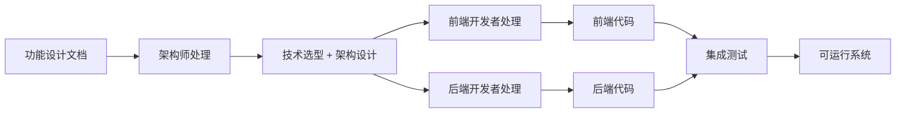

# 设计到代码自动化工作流

## 工作流概述

本工作流实现从**功能设计文档**到**可运行代码**的自动化转换。



## 输入输出规范

### 输入：功能设计文档
- 完整的用户流程
- 详细的功能规格
- 界面设计要点
- 验收标准
- 技术约束和风险

### 输出：可运行代码
- 项目源代码
- 数据库迁移脚本
- API 文档
- 单元测试
- 部署配置文件

## 自动化处理流程

### 步骤 1: 技术栈选择
**执行代理**: 架构师  
**处理内容**:
1. 基于功能需求选择合适的技术栈
2. 考虑团队技术能力和项目规模
3. 评估技术的成熟度和社区支持
4. 确定开发和生产环境配置

**输出**: 技术栈规格书

```yaml
技术栈:
  前端: React 18 + TypeScript + Vite
  UI 库：Ant Design 5.x
  状态管理：Zustand
  样式：Tailwind CSS
  
  后端：Node.js 18 + Express/NestJS
  数据库：PostgreSQL 15
  ORM: Prisma
  缓存：Redis
  
  认证：JWT + bcrypt
  部署：Docker + Kubernetes
```

### 步骤 2: 项目脚手架搭建
**执行代理**: DevOps 工程师  
**处理内容**:
1. 创建项目目录结构
2. 初始化包管理器配置
3. 配置开发工具和 linting 规则
4. 设置 Git hooks 和 CI/CD基础

**输出**: 完整的项目骨架

```bash
my-project/
├── frontend/              # 前端代码
│   ├── src/
│   │   ├── components/   # 可复用组件
│   │   ├── pages/        # 页面组件
│   │   ├── hooks/        # 自定义 Hooks
│   │   ├── stores/       # 状态管理
│   │   └── utils/        # 工具函数
│   ├── package.json
│   └── vite.config.ts
│
├── backend/               # 后端代码
│   ├── src/
│   │   ├── controllers/  # 控制器层
│   │   ├── services/     # 业务逻辑层
│   │   ├── models/       # 数据模型
│   │   ├── routes/       # 路由定义
│   │   └── middleware/   # 中间件
│   ├── prisma/           # 数据库 Schema
│   └── package.json
│
└── docker-compose.yml    # Docker 配置
```

### 步骤 3: 数据库 Schema 设计
**执行代理**: 后端开发者  
**处理内容**:
1. 基于功能需求设计数据模型
2. 定义表结构和关系
3. 创建索引优化查询性能
4. 编写数据库迁移脚本

**输出**: Prisma Schema + 迁移文件

```prisma
// schema.prisma
model User {
  id            String    @id @default(uuid())
  email         String    @unique
  passwordHash  String
  firstName     String?
  lastName      String?
  isActive      Boolean   @default(true)
  loginAttempts Int       @default(0)
  lockedUntil   DateTime?
  createdAt     DateTime  @default(now())
  updatedAt     DateTime  @updatedAt
  
  @@index([email])
  @@index([createdAt])
}
```

### 步骤 4: API 接口实现
**执行代理**: 后端开发者  
**处理内容**:
1. 基于设计文档定义 API 端点
2. 实现请求验证和错误处理
3. 编写业务逻辑和服务层
4. 集成认证和授权机制

**输出**: RESTful API 代码

```typescript
// auth.controller.ts
import { Controller, Post, Body, HttpCode, HttpStatus } from '@nestjs/common';
import { AuthService } from './auth.service';
import { LoginDto } from './dto/login.dto';

@Controller('api/auth')
export class AuthController {
  constructor(private authService: AuthService) {}

  @Post('login')
  @HttpCode(HttpStatus.OK)
  async login(@Body() loginDto: LoginDto) {
    // 验证登录凭据
   const user = await this.authService.validateUser(
      loginDto.email,
      loginDto.password
    );
    
   if (!user) {
      throw new UnauthorizedException('邮箱或密码错误');
    }
    
    // 检查账户锁定状态
   if (user.lockedUntil && user.lockedUntil > new Date()) {
      throw new TooManyRequestsException(
        `账户已锁定，请在${user.lockedUntil.toLocaleString()}后重试`
      );
    }
    
    // 生成 JWT token
   const tokens = await this.authService.generateTokens(user);
    
    // 重置登录失败次数
    await this.authService.resetLoginAttempts(user.id);
    
    return {
      data: {
        user: {
          id: user.id,
         email: user.email,
          name: `${user.firstName} ${user.lastName}`,
        },
        ...tokens,
      },
    };
  }
}
```

### 步骤 5: 前端界面实现
**执行代理**: 前端开发者  
**处理内容**:
1. 基于界面设计创建组件
2. 实现用户交互逻辑
3. 集成状态管理
4. 添加表单验证和错误提示

**输出**: React 组件代码

```tsx
// LoginPage.tsx
import React, { useState } from 'react';
import { Form, Input, Button, Checkbox, message } from'antd';
import { UserOutlined, LockOutlined } from '@ant-design/icons';
import { useAuthStore } from '@/stores/auth.store';

interface LoginFormValues {
  email: string;
  password: string;
 remember?: boolean;
}

export const LoginPage: React.FC = () => {
  const [loading, setLoading] = useState(false);
  const login = useAuthStore((state) => state.login);

  const onFinish = async (values: LoginFormValues) => {
    setLoading(true);
    try {
      await login(values.email, values.password, values.remember);
     message.success('登录成功！');
    } catch (error: any) {
     message.error(error.message || '登录失败，请重试');
    } finally {
      setLoading(false);
    }
  };

 return (
    <div className="min-h-screen flex items-center justify-center bg-gray-50">
      <div className="max-w-md w-full space-y-8 p-8 bg-white rounded-lg shadow-lg">
        <div>
          <h2 className="mt-6 text-center text-3xl font-extrabold text-gray-900">
            用户登录
          </h2>
        </div>
        
        <Form
          name="login"
          initialValues={{ remember: true }}
          onFinish={onFinish}
          size="large"
        >
          <Form.Item
            name="email"
            rules={[
              { required: true, message: '请输入邮箱' },
              { type: 'email', message: '邮箱格式不正确' }
            ]}
          >
            <Input 
              prefix={<UserOutlined />} 
              placeholder="邮箱地址"
            />
          </Form.Item>

          <Form.Item
            name="password"
            rules={[
              { required: true, message: '请输入密码' },
              { min: 8, message: '密码长度至少 8 位' }
            ]}
          >
            <Input.Password
              prefix={<LockOutlined />}
              placeholder="密码"
            />
          </Form.Item>

          <Form.Item>
            <Form.Item name="remember" valuePropName="checked" noStyle>
              <Checkbox>记住我（7 天）</Checkbox>
            </Form.Item>
            <a className="float-right" href="/forgot-password">
              忘记密码？
            </a>
          </Form.Item>

          <Form.Item>
            <Button
              type="primary" 
              htmlType="submit" 
              loading={loading}
              block
              size="large"
            >
              登录
            </Button>
          </Form.Item>
        </Form>
      </div>
    </div>
  );
};
```

### 步骤 6: 单元测试编写
**执行代理**: 测试工程师  
**处理内容**:
1. 为关键业务逻辑编写测试
2. 覆盖正常流程和异常场景
3. 使用 Mock 隔离外部依赖
4. 确保测试覆盖率达标

**输出**: 测试代码

```typescript
// auth.service.spec.ts
import { Test, TestingModule } from '@nestjs/testing';
import { AuthService } from './auth.service';
import { PrismaService } from '../prisma/prisma.service';
import { JwtService } from '@nestjs/jwt';
import * as bcrypt from'bcrypt';

describe('AuthService', () => {
  let service: AuthService;
  let prisma: PrismaService;

  beforeEach(async () => {
   const module: TestingModule = await Test.createTestingModule({
      providers: [
        AuthService,
        {
          provide: PrismaService,
          useValue: {
            users: {
              findUnique: jest.fn(),
              update: jest.fn(),
            },
          },
        },
        {
          provide: JwtService,
          useValue: {},
        },
      ],
    }).compile();

    service = module.get<AuthService>(AuthService);
    prisma = module.get<PrismaService>(PrismaService);
  });

  it('should validate user with correct credentials', async () => {
   const mockUser= {
      id: 'usr_123',
     email: 'test@example.com',
     passwordHash: await bcrypt.hash('password123', 10),
      loginAttempts: 0,
      lockedUntil: null,
    };

    jest.spyOn(prisma.users, 'findUnique').mockResolvedValue(mockUser as any);

   const result = await service.validateUser(
      'test@example.com',
      'password123'
    );

   expect(result).toBeDefined();
   expect(result?.id).toBe(mockUser.id);
  });

  it('should return null for invalid password', async () => {
   const mockUser = {
      id: 'usr_123',
     email: 'test@example.com',
     passwordHash: await bcrypt.hash('password123', 10),
    };

    jest.spyOn(prisma.users, 'findUnique').mockResolvedValue(mockUser as any);

   const result = await service.validateUser(
      'test@example.com',
      'wrong_password'
    );

   expect(result).toBeNull();
  });
});
```

### 步骤 7: 集成和联调
**执行代理**: 前端 + 后端开发者  
**处理内容**:
1. 连接前后端服务
2. 测试完整的用户流程
3. 修复集成问题
4. 优化性能和用户体验

**输出**: 集成的完整系统

### 步骤 8: 代码审查和优化
**执行代理**: 代码审查员 + 安全专家  
**处理内容**:
1. 代码规范检查
2. 安全漏洞扫描
3. 性能瓶颈识别
4. 重构建议和实施

**输出**: 代码审查报告 + 优化后的代码

## CLI 命令接口

```bash
# 从设计文档生成代码
agency generate-code \
  --design feature-design.md \
  --output my-project/ \
  --tech-stack "react+nestjs+postgresql" \
  --tests

# 查看生成的代码结构
agency view-code my-project/

# 运行代码审查
agency review-code \
  --path my-project/ \
  --checkers "security,performance,style" \
  --output code-review.md

# 运行测试
agency run-tests\
  --path my-project/ \
  --coverage \
  --threshold 90

# 构建生产版本
agency build \
  --path my-project/ \
  --optimize \
  --output dist/
```

## 质量门禁

### 代码质量标准
- 单元测试覆盖率 > 90%
- 无严重安全漏洞
- 代码规范检查通过
- 无编译错误和警告

### 功能完整性标准
- 所有功能需求已实现
- 用户流程完整可运行
- 错误处理完善
- 验收标准全部满足

### 性能标准
- API 响应时间 P95 < 200ms
- 页面加载时间 < 3 秒
- 数据库查询有索引优化
- 无明显的性能瓶颈

## 示例：登录功能代码生成

### 输入
功能设计文档（来自 requirements-to-design 工作流）

### 输出
完整的登录系统代码，包括:
- 前端登录页面组件
- 后端认证 API
- 数据库用户表
- JWT 认证逻辑
- 单元测试
- Docker 部署配置

---

**前端开发者**: Frontend Developer  
**后端开发者**: Backend Developer  
**创建日期**: 2026-03-24  
**版本**: 1.0  
**状态**: 就绪
