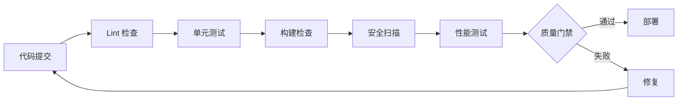

# 基础质量检查机制

## 质量检查体系概述

本机制提供从代码到功能的全面质量验证，确保交付物符合预期标准。

## 质量检查层级

### Level 1: 代码规范检查
**执行代理**: 代码审查员  
**检查工具**: ESLint, Prettier, SonarQube  
**检查内容**:
- 代码格式和风格一致性
- 命名规范和注释质量
- 代码复杂度（圈复杂度 < 10）
- 重复代码检测
- 未使用代码和导入

**通过标准**:
```yaml
ESLint: 0 errors, warnings < 10
Prettier: 100% 文件格式化
SonarQube: 
  - Code Smells < 5
  - Bugs: 0
  - Vulnerabilities: 0
  - 技术债务比率 < 3%
```

### Level 2: 功能验证
**执行代理**: 测试工程师  
**检查内容**:
- 单元测试覆盖率 > 90%
- 集成测试通过率 100%
- E2E 测试关键路径通过
- 边界条件和异常场景覆盖

**通过标准**:
```yaml
单元测试:
  - 行覆盖率 > 90%
  - 分支覆盖率 > 85%
  - 函数覆盖率 > 90%
  
集成测试:
  - API 端点测试 100% 通过
  - 数据库操作测试通过
  - 第三方服务 Mock 测试通过
  
E2E 测试:
  - 关键用户流程 100% 通过
  - 跨浏览器测试通过
  - 响应式布局测试通过
```

### Level 3: 安全检查
**执行代理**: 安全专家  
**检查工具**: Snyk, OWASP ZAP, Semgrep  
**检查内容**:
- OWASP Top 10 漏洞扫描
- 依赖包安全漏洞
- SQL 注入和 XSS 防护
- 认证和授权机制
- 数据加密和隐私保护

**通过标准**:
```yaml
Snyk:
  - 严重漏洞：0
  - 高危漏洞：0
  - 中危漏洞：< 5
  
OWASP ZAP:
  - High Alert: 0
  - Medium Alert: < 3
  
Semgrep:
  - Critical: 0
  - Error: 0
  - Warning: < 10
```

### Level 4: 性能验证
**执行代理**: 性能优化师  
**检查工具**: Lighthouse, k6, WebPageTest  
**检查内容**:
- Core Web Vitals 指标
- API 响应时间
- 数据库查询性能
- 资源加载优化
- 并发负载能力

**通过标准**:
```yaml
Core Web Vitals:
  - LCP < 2.5s
  - FID < 100ms
  - CLS < 0.1
  
API 性能:
  - P50 < 100ms
  - P95 < 200ms
  - P99 < 500ms
  
Lighthouse:
  - Performance > 90
  - Accessibility > 90
  - Best Practices > 90
  - SEO > 90
```

### Level 5: 用户体验验证
**执行代理**: 现实检查器  
**检查内容**:
- 设计还原度检查
- 交互流畅性
- 错误提示友好性
- 无障碍访问合规
- 跨设备兼容性

**通过标准**:
```yaml
设计还原:
  - UI 组件与设计稿一致 > 95%
  - 颜色和字体符合设计规范
  - 间距和布局符合设计
  
交互体验:
  - 页面切换流畅无卡顿
  - 表单验证实时反馈
  - 加载状态清晰可见
  
无障碍:
  - WCAG 2.1 AA 合规
  - 键盘导航完整
  - 屏幕阅读器兼容
  
兼容性:
  - Chrome/Firefox/Safari/Edge支持
  - 移动端 iOS/Android支持
  - 平板和桌面响应式
```

## 质量检查流程

### 自动化检查流水线


### 手动检查清单
- [ ] 功能完整性确认
- [ ] 用户体验评审
- [ ] 文档完整性检查
- [ ] 利益相关者验收

## CLI 命令接口

```bash
# 运行全部质量检查
agency quality-check \
  --path my-project/ \
  --levels all \
  --output quality-report.md

# 运行代码规范检查
agency lint-code \
  --path my-project/ \
  --fix \
  --report lint-report.md

# 运行安全扫描
agency security-scan \
  --path my-project/ \
  --severity high \
  --output security-report.md

# 运行性能测试
agency performance-test \
  --url http://localhost:3000 \
  --scenarios login,checkout \
  --concurrency 100 \
  --duration 5m

# 生成质量报告
agency generate-quality-report \
  --checks all \
  --format markdown \
  --output quality-summary.md
```

## 质量报告模板

```markdown
# 质量检查报告：[项目名称]

## 执行摘要
**检查日期**: 2026-04-21  
**检查范围**: 代码、功能、安全、性能  
**整体评分**: A/B/C/D/F  
**状态**: ✅ 通过 / ⚠️ 有条件通过 / ❌ 不通过

## 检查结果

### Level 1: 代码规范
**评分**: A (95/100)  
**状态**: ✅ 通过

**详细结果**:
- ESLint: 0 errors, 5 warnings
- Prettier: 100% 格式化
- 圈复杂度：平均 3.2, 最大 7
- 重复代码：2.1%

**需要改进**:
1. utils/helper.ts 中有 3 个函数复杂度 > 8
2. 缺少 JSDoc 注释的文件：5 个

### Level 2: 功能验证
**评分**: A (98/100)  
**状态**: ✅ 通过

**测试覆盖**:
- 行覆盖率：92.5%
- 分支覆盖率：87.3%
- 函数覆盖率：94.1%

**测试结果**:
- 单元测试：458 passed, 0 failed
- 集成测试：67 passed, 0 failed
- E2E 测试：23 passed, 0 failed

### Level 3: 安全检查
**评分**: B (85/100)  
**状态**: ⚠️ 需要关注

**漏洞扫描**:
- 严重：0
- 高危：0
- 中危：3
- 低危：12

**发现的问题**:
1. [中危] 依赖包 lodash@4.17.20 有原型污染漏洞 → 升级到 4.17.21
2. [中危] Cookie 缺少 SameSite 属性 → 添加 SameSite=strict
3. [中危] 缺少内容安全策略头部 → 配置 CSP

### Level 4: 性能验证
**评分**: A (93/100)  
**状态**: ✅ 通过

**Core Web Vitals**:
- LCP: 1.8s ✅
- FID: 45ms ✅
- CLS: 0.05 ✅

**API 性能**:
- P50: 78ms ✅
- P95: 156ms ✅
- P99: 320ms ✅

**Lighthouse 评分**:
- Performance: 94 ✅
- Accessibility: 96 ✅
- Best Practices: 92 ✅
- SEO: 98 ✅

### Level 5: 用户体验
**评分**: A (91/100)  
**状态**: ✅ 通过

**设计还原**: 96%  
**交互流畅性**: 优秀  
**错误提示**: 友好清晰  
**无障碍**: WCAG 2.1 AA 合规  
**兼容性**: 全平台支持

## 问题汇总

### 严重问题 (必须修复)
无

### 中等问题 (建议修复)
1. 3 个中危安全漏洞
2. 5 个文件缺少文档注释
3. 2 个函数复杂度过高

### 轻微问题 (可选优化)
1. 部分 CSS 可以进一步压缩
2. 图片可以使用 WebP 格式
3. 可以考虑添加 Service Worker

## 发布建议

**状态**: ✅ 批准发布

**前提条件**:
- [x] 所有严重问题已解决
- [x] 测试覆盖率达标
- [x] 性能指标符合预期
- [ ] 中危安全漏洞需在 1 周内修复

**风险提示**:
- 3 个中危安全漏洞需要尽快修复
- 建议在下次迭代中降低代码复杂度

---
**质量团队**: QA Team  
**报告日期**: 2026-04-21  
**下次检查**: 2026-04-28
```

## 质量门禁规则

### 发布准出门禁
```yaml
必须满足:
  - 无严重安全问题
  - 无严重 bug
  - 测试覆盖率 > 90%
  - 核心功能测试 100% 通过
  - 性能指标达标
  
建议满足:
  - 无高危安全问题
  - 代码规范 warnings < 20
  - 技术债务比率 < 5%
  - 文档完整率 > 95%
```

### 持续集成门禁
```yaml
每次提交必须:
  - Lint 检查通过
  - 单元测试通过
  - 构建成功
  - 无新增严重代码异味
  
每周必须:
  - 安全扫描通过
  - 性能回归测试通过
  -E2E 测试通过
```

## 质量问题处理流程

### 问题分级
- **P0-严重**: 立即修复，停止发布
- **P1-高危**: 24 小时内修复
- **P2-中危**: 3 天内修复
- **P3-低危**: 下次迭代修复

### 升级机制
- 同一类问题出现 3 次 → 升级到技术负责人
- 影响发布时间超过 2 天 → 升级到项目经理
- 客户投诉的质量问题 → 升级到产品负责人

---

**测试工程师**: Test Engineer  
**安全专家**: Security Expert  
**创建日期**: 2026-04-21  
**版本**: 1.0  
**状态**: 就绪
