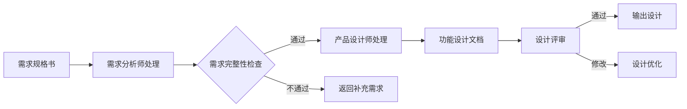

# 需求到设计自动化工作流

## 工作流概述

本工作流实现从**需求规格说明书**到**功能设计文档**的自动化转换。



## 输入输出规范

### 输入：需求规格说明书
```markdown
# 需求规格说明：[功能名称]

## 功能概述
[功能描述和业务价值]

## 功能需求
### FR-001: [功能点 1]
**描述**: [详细说明]
**验收标准**: 
- [ ] Given [条件], When [操作], Then [结果]

### FR-002: [功能点 2]
...

## 非功能需求
### NFR-001: 性能要求
[性能指标]

### NFR-002: 安全要求
[安全要求]

## 优先级
MoSCoW 评级：[Must/Should/Could/Won't]
```

### 输出：功能设计文档
```markdown
# 功能设计：[功能名称]

## 功能概述
**价值主张**: [一句话说明用户价值]
**目标用户**: [主要用户群体]
**业务目标**: [要达成的业务指标]

## 用户流程
[完整的用户使用路径图]

## 功能详情

### 子功能 A: [名称]
**描述**: [详细功能说明]
**输入**: [用户输入或系统输入]
**处理逻辑**: [业务规则和处理流程]
**输出**: [结果展示或后续动作]
**异常处理**: [错误场景和应对方案]

### 子功能 B: [名称]
...

## 界面设计要点
**布局**: [页面结构和信息架构]
**交互**: [关键交互行为和反馈]
**视觉**: [样式要求和品牌元素]
**响应式**: [不同设备的适配方案]

## 验收标准

### 功能性验收
- [ ] Given [场景], When [操作], Then [预期结果]
- [ ] Given [场景], When [操作], Then [预期结果]

### 非功能性验收
- [ ] 性能：[具体性能指标]
- [ ] 安全：[安全要求]
- [ ] 兼容性：[支持的浏览器/设备]

## 依赖与风险
**外部依赖**: [第三方服务、API 等]
**技术风险**: [可能的技术难点]
**缓解措施**: [风险应对方案]
```

## 自动化处理流程

### 步骤 1: 需求解析
**执行代理**: 需求分析师  
**处理内容**:
1. 提取需求关键词和核心功能点
2. 识别用户角色和使用场景
3. 分析功能依赖关系
4. 评估需求完整性和一致性

**输出**: 需求解析报告

### 步骤 2: 用户故事生成
**执行代理**: 产品设计师  
**处理内容**:
1. 将功能需求转换为用户故事格式
2. 定义每个故事的验收标准
3. 创建用户故事地图
4. 识别 MVP 功能和迭代规划

**输出**: 用户故事列表

### 步骤 3: 功能分解
**执行代理**: 产品设计师  
**处理内容**:
1. 将用户故事拆解为具体的子功能
2. 定义每个子功能的输入 - 处理 - 输出
3. 识别功能间的依赖和数据流
4. 确定功能实现的优先级

**输出**: 功能分解结构

### 步骤 4: 流程设计
**执行代理**: 产品设计师  
**处理内容**:
1. 绘制用户操作流程
2. 识别关键决策点
3. 设计异常处理流程
4. 考虑边界场景

**输出**: 用户流程图

### 步骤 5: 界面设计建议
**执行代理**: 产品设计师  
**处理内容**:
1. 基于功能需求提出界面布局建议
2. 定义关键交互行为
3. 考虑响应式设计要求
4. 参考无障碍设计标准

**输出**: 界面设计要点

### 步骤 6: 验收标准细化
**执行代理**: 产品设计师 + 测试工程师  
**处理内容**:
1. 将高层验收标准拆解为可测试的条件
2. 使用 Given-When-Then 格式规范化
3. 覆盖正常流程和异常场景
4. 包含非功能性验收标准

**输出**: 详细验收标准

### 步骤 7: 风险评估
**执行代理**: 架构师  
**处理内容**:
1. 识别技术实现风险
2. 评估外部依赖风险
3. 分析资源和时间约束
4. 提出风险缓解建议

**输出**: 风险评估报告

### 步骤 8: 设计文档整合
**执行代理**: 产品设计师  
**处理内容**:
1. 整合所有分析和设计成果
2. 确保文档结构清晰完整
3. 验证设计满足所有需求
4. 准备设计评审材料

**输出**: 功能设计文档（终稿）

## 质量检查清单

### 需求完整性检查
- [ ] 所有功能需求都有明确的验收标准
- [ ] 非功能需求可量化和可测试
- [ ] 用户角色和使用场景清晰
- [ ] 功能优先级已定义
- [ ] 无矛盾和重复的需求

### 设计规范检查
- [ ] 用户流程完整且合理
- [ ] 功能分解粒度适中
- [ ] 界面设计符合用户体验原则
- [ ] 验收标准可测试
- [ ] 风险已识别并有应对措施

### 可实施性检查
- [ ] 技术方案可行
- [ ] 资源需求明确
- [ ] 时间估算合理
- [ ] 依赖关系清晰
- [ ] 风险可控

## CLI 命令接口

```bash
# 从需求生成设计文档
agency generate-design \
  --requirements requirements-spec.md \
  --output feature-design.md \
  --reviewers "产品设计师，架构师"

# 查看生成的设计文档
agency view-design feature-design.md

# 设计文档评审
agency review-design \
  --design feature-design.md \
  --reviewers "开发团队，测试团队" \
  --feedback design-feedback.md

# 基于反馈优化设计
agency optimize-design \
  --design feature-design.md \
  --feedback design-feedback.md \
  --output feature-design-v2.md
```

## 示例：用户登录功能

### 输入示例
```markdown
# 需求规格说明：用户登录系统

## 功能概述
实现安全的用户认证系统，支持多种登录方式。

## 功能需求
### FR-001: 邮箱密码登录
**描述**: 用户可以通过注册邮箱和密码登录
**验收标准**: 
- [ ] 有效凭据登录后获得访问令牌
- [ ] 无效凭据返回明确错误提示
- [ ] 连续 5 次失败后锁定账户 30 分钟

### FR-002: 记住登录状态
**描述**: 用户可选择 7 天内自动登录
**验收标准**:
- [ ] 勾选"记住我"后 7 天内无需重新登录
- [ ] 用户可主动注销登录

## 非功能需求
### NFR-001: 性能要求
- 登录响应时间 < 500ms (P95)

### NFR-002: 安全要求
- 密码使用 bcrypt 加密存储
- 所有通信使用 HTTPS
```

### 输出示例
```markdown
# 功能设计：用户登录系统

## 功能概述
**价值主张**: 为用户提供安全便捷的登录体验
**目标用户**: 所有注册用户
**业务目标**: 提升登录转化率，降低账户被盗风险

## 用户流程
```
1. 用户访问登录页面
2. 输入邮箱和密码
3. （可选）勾选"记住我"
4. 点击登录按钮
5. 系统验证凭据
6. 成功则跳转首页，失败则显示错误
```

## 功能详情

### 子功能 A: 登录表单
**描述**: 收集用户凭据的界面
**输入**: 用户输入邮箱、密码
**处理逻辑**: 
- 前端验证邮箱格式
- 前端验证密码长度（8-20 位）
- 提交到后端验证
**输出**: 登录成功或失败
**异常处理**: 
- 网络错误：显示重试按钮
- 服务器错误：显示友好错误消息

### 子功能 B: 身份验证
**描述**: 验证用户身份的后台服务
**输入**: 邮箱、密码
**处理逻辑**:
1. 查询用户信息
2. 验证密码哈希
3. 检查账户锁定状态
4. 生成 JWT token
**输出**: 访问令牌或错误信息
**异常处理**:
- 用户不存在：返回通用错误
- 密码错误：记录失败次数
- 账户锁定：显示解锁时间

### 子功能 C: 记住登录
**描述**: 持久化登录状态
**输入**: 用户选择"记住我"
**处理逻辑**:
1. 生成刷新令牌（有效期 7 天）
2. 设置 HttpOnly cookie
3. 实现自动登录逻辑
**输出**: 持久化的登录状态
**异常处理**:
- 令牌过期：要求重新登录
- 令牌被撤销：强制登出

## 界面设计要点
**布局**: 
- 居中的登录卡片
- 清晰的输入框和标签
- 醒目的登录按钮
**交互**:
- 实时邮箱格式验证
- 密码强度指示器
- 错误消息即时显示
**视觉**:
- 品牌色主按钮
- 清晰的错误状态红色提示
- 成功状态绿色提示
**响应式**:
- 移动端：全宽布局
- 桌面端：固定宽度居中

## 验收标准

### 功能性验收
- [ ] Given 正确凭据，When 点击登录，Then 成功跳转
- [ ] Given 错误凭据，When 点击登录，Then 显示错误提示
- [ ] Given 连续 5 次失败，When 第 6 次尝试，Then 账户锁定 30 分钟
- [ ] Given 勾选"记住我", When 登录成功，Then 7 天内自动登录

### 非功能性验收
- [ ] 性能：P95 响应时间 < 500ms
- [ ] 安全：密码 bcrypt 加密，HTTPS 传输
- [ ] 兼容性：支持 Chrome、Firefox、Safari、Edge

## 依赖与风险
**外部依赖**: 
- 邮件服务（用于忘记密码）
- Redis（用于账户锁定计数）

**技术风险**:
- JWT 令牌泄露风险 → 使用 HttpOnly + Secure cookie
- 暴力破解攻击 → 实施速率限制和账户锁定

**缓解措施**:
- 实施多因素认证（下一阶段）
- 添加图形验证码（多次失败后）
```

## 成功指标

- 设计文档生成时间 < 10 分钟
- 设计评审一次性通过率 > 70%
- 开发团队对设计的满意度 > 85%
- 需求覆盖率 100%
- 零重大设计遗漏

---

**产品设计师**: Product Designer  
**创建日期**: 2026-03-24  
**版本**: 1.0  
**状态**: 就绪
